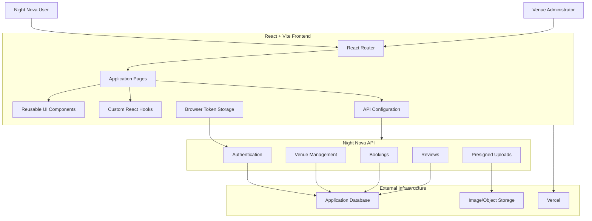
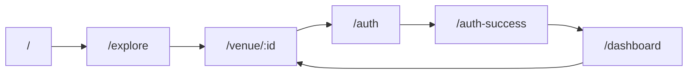
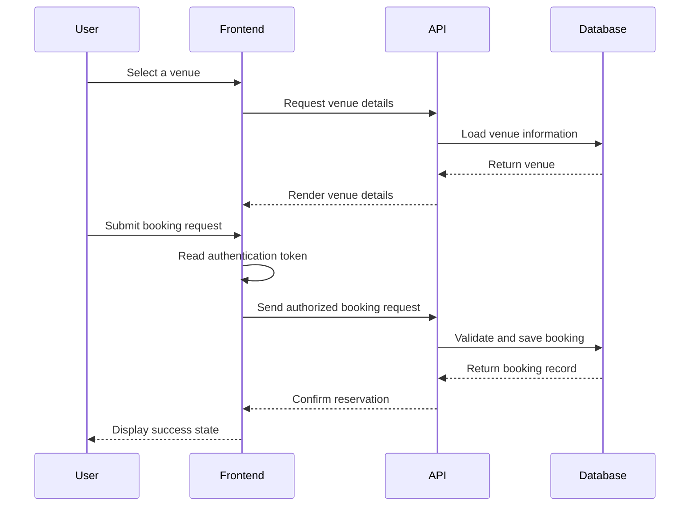
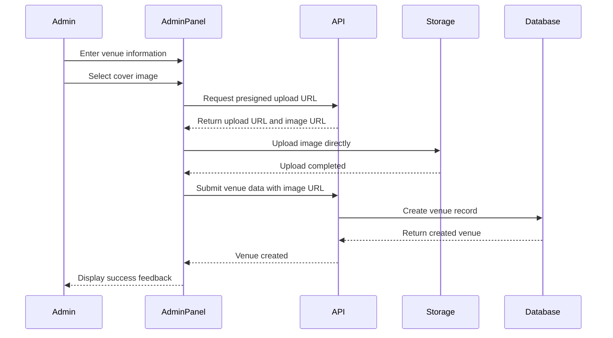
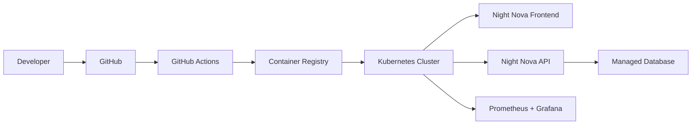

<div align="center">

# 🌙 NIGHT NOVA

### Discover the city after dark.

A modern nightlife discovery and venue-booking platform designed to help users explore clubs, lounges, cafés, rooftop venues, live events, and late-night experiences.

[](https://night-nova-aru.vercel.app/)
[](https://github.com/ARPITPRAJAPATI/Night-Nova)


</div>

---

## Overview

**Night Nova** is a full-stack nightlife discovery platform that connects users with venues and experiences across the city.

The application provides a visually immersive interface where users can:

* Discover nightlife venues
* Browse venues by city and category
* View live occupancy and operational status
* Explore detailed venue information
* Check ratings, pricing, amenities, and opening hours
* Reserve or book venue experiences
* Review previously visited venues
* Manage bookings through a personal dashboard
* Authenticate using supported login methods
* Onboard and manage venues through an administrative interface

Night Nova is designed around a dark, neon-inspired visual identity that reflects the atmosphere of modern nightlife.

> Not every city sleeps. Night Nova shows you where it comes alive.

---

## Live Application

**Production:**
https://night-nova-aru.vercel.app

**Repository:**
https://github.com/ARPITPRAJAPATI/Night-Nova

---

## Key Features

### Nightlife Discovery

* Browse clubs, lounges, cafés, rooftops, and entertainment venues
* Explore venues across multiple cities
* Search and filter available nightlife experiences
* Discover trending and featured venues
* View visually rich venue cards
* Check whether a venue is currently open
* View live or estimated venue occupancy
* Compare ratings and price categories
* Browse venue-specific tags and atmosphere indicators

### Venue Details

Each venue can display:

* Venue name
* Location and physical address
* Venue category
* Description
* Cover image
* Opening and closing times
* Entry fee
* Price range
* Capacity
* Current occupancy
* User rating
* Dress code
* Amenities
* Phone number
* Website
* Instagram profile
* Open or closed status
* User reviews

### Booking Experience

* Open a venue-specific booking interface
* Select booking details
* Submit reservation requests
* Associate bookings with authenticated users
* View reservations inside the user dashboard
* Track booking-related information
* Display loading and success states
* Present clear feedback when booking actions fail

### Authentication

* User authentication interface
* Authentication success handling
* Protected user experiences
* Token-based API authorization
* Persistent login information through browser storage
* Authenticated dashboard access
* Conditional navigation for logged-in users

### User Dashboard

* View account-related activity
* Access existing bookings
* Review reservation details
* Manage user-specific nightlife activity
* Display booking records through a structured table
* Provide a central location for customer actions

### Reviews and Ratings

* Display venue ratings
* Render star-based rating components
* Show customer reviews
* Allow users to evaluate venue experiences
* Add social proof to venue-detail pages

### Administrative Venue Management

Night Nova includes an administrative venue-onboarding interface for adding new venues.

Administrators can configure:

* Venue name
* City
* Venue type
* Address
* Description
* Atmospheric tags
* Amenities
* Current occupancy
* Starting rating
* Cover image
* Phone number
* Website
* Instagram profile
* Opening time
* Closing time
* Entry fee
* Dress code
* Venue capacity
* Price range
* Open or closed status

### Image Upload Workflow

The administrative interface supports:

* Local image selection
* Immediate image preview
* Presigned upload URL generation
* Direct file upload
* Upload progress tracking
* Remote image URL persistence
* Upload success and error states

---

## Product Experience

```text
Visitor opens Night Nova
          │
          ▼
Explore cities and venues
          │
          ▼
Filter nightlife experiences
          │
          ▼
Open venue details
          │
          ├── Check occupancy
          ├── View timings
          ├── Compare ratings
          ├── Explore amenities
          └── Read reviews
          │
          ▼
Authenticate
          │
          ▼
Book a venue
          │
          ▼
Manage booking from dashboard
```

---

## Application Architecture



---

## Frontend Routing



The frontend uses React Router to provide client-side navigation between the main application experiences.

---

## Booking Flow



---

## Venue Onboarding Flow



---

## Technology Stack

| Area                | Technology               |
| ------------------- | ------------------------ |
| User Interface      | React 19                 |
| Build Tool          | Vite 8                   |
| Routing             | React Router DOM         |
| Language            | JavaScript               |
| Module System       | ES Modules               |
| Styling             | Tailwind CSS             |
| Animations          | Framer Motion            |
| Icons               | Lucide React             |
| HTTP Communication  | Fetch API                |
| API Logging Support | Morgan                   |
| Deployment          | Vercel                   |
| Code Quality        | ESLint                   |
| CSS Processing      | PostCSS and Autoprefixer |

---

## Design System

Night Nova uses a nightlife-focused visual design language:

```text
Dark atmospheric surfaces
        +
Neon violet accents
        +
Glassmorphism
        +
Soft border lighting
        +
Animated transitions
        +
High-contrast typography
        =
Night Nova Experience
```

### Interface Characteristics

* Dark-first interface
* Neon purple branding
* Glass-style cards and panels
* Responsive navigation
* Animated page transitions
* Loading skeletons
* Interactive hover effects
* Motion-based modals
* Occupancy visualizations
* Reusable status indicators
* Mobile-responsive layouts

---

## Repository Structure

```text
Night-Nova/
├── public/
│   └── Static application assets
│
├── server/
│   └── Backend/API implementation
│
├── src/
│   ├── components/
│   │   ├── BookingModal.jsx
│   │   ├── BookingsTable.jsx
│   │   ├── DetailPanel.jsx
│   │   ├── Footer.jsx
│   │   ├── GlowCard.jsx
│   │   ├── Lightbox.jsx
│   │   ├── Navbar.jsx
│   │   ├── OccBar.jsx
│   │   ├── ReviewsSection.jsx
│   │   ├── SkeletonLoader.jsx
│   │   ├── StarRating.jsx
│   │   ├── StatusDot.jsx
│   │   └── VenueCard.jsx
│   │
│   ├── hooks/
│   │   └── Custom React hooks
│   │
│   ├── pages/
│   │   ├── Auth.jsx
│   │   ├── AuthSuccess.jsx
│   │   ├── Dashboard.jsx
│   │   ├── Explore.jsx
│   │   ├── Home.jsx
│   │   └── VenueDetail.jsx
│   │
│   ├── utils/
│   │   └── Shared utilities
│   │
│   ├── AdminPanel.jsx
│   ├── App.jsx
│   ├── config.js
│   ├── index.css
│   └── main.jsx
│
├── .gitignore
├── eslint.config.js
├── index.html
├── package.json
├── postcss.config.js
├── tailwind.config.js
├── vercel.json
├── vite.config.js
└── README.md
```

---

## Component Architecture

```text
App
├── Navbar
├── Routes
│   ├── Home
│   ├── Explore
│   │   ├── VenueCard
│   │   ├── GlowCard
│   │   ├── OccBar
│   │   ├── StatusDot
│   │   └── SkeletonLoader
│   │
│   ├── VenueDetail
│   │   ├── DetailPanel
│   │   ├── Lightbox
│   │   ├── BookingModal
│   │   ├── ReviewsSection
│   │   └── StarRating
│   │
│   ├── Auth
│   ├── AuthSuccess
│   └── Dashboard
│       └── BookingsTable
│
├── AdminPanel
└── Footer
```

---

## API Configuration

The frontend reads its backend URL from:

```env
VITE_API_URL=http://localhost:5000/api
```

The API configuration automatically ensures that the configured backend URL includes the `/api` suffix.

Example production configuration:

```env
VITE_API_URL=https://your-night-nova-api.example.com/api
```

Never expose private credentials through variables prefixed with `VITE_`. Variables beginning with `VITE_` become accessible to browser-side code.

---

## Getting Started

### Prerequisites

Install:

* Node.js 20 or newer
* npm
* Git
* Access to a compatible Night Nova backend API

Verify the installation:

```bash
node --version
npm --version
git --version
```

---

## Installation

Clone the repository:

```bash
git clone https://github.com/ARPITPRAJAPATI/Night-Nova.git
cd Night-Nova
```

Install frontend dependencies:

```bash
npm install
```

Create a local environment file:

```bash
touch .env
```

On PowerShell:

```powershell
New-Item .env -ItemType File
```

Add the API URL:

```env
VITE_API_URL=http://localhost:5000/api
```

Start the development server:

```bash
npm run dev
```

Open the URL displayed by Vite, normally:

```text
http://localhost:5173
```

---

## Available Scripts

| Command           | Purpose                              |
| ----------------- | ------------------------------------ |
| `npm run dev`     | Start the Vite development server    |
| `npm run build`   | Create an optimized production build |
| `npm run preview` | Preview the production build locally |
| `npm run lint`    | Run ESLint across the project        |

---

## Production Build

Run:

```bash
npm run lint
npm run build
npm run preview
```

The generated static application will be placed inside:

```text
dist/
```

---

## Deployment

The frontend is configured for deployment through Vercel.

### Deployment Flow

```text
GitHub Repository
       │
       ▼
Vercel Import
       │
       ├── npm install
       ├── npm run build
       ├── Generate dist/
       ├── Apply SPA rewrites
       └── Configure VITE_API_URL
               │
               ▼
      Night Nova Production
```

### Vercel Configuration

Use these values when importing the project:

| Setting          | Value           |
| ---------------- | --------------- |
| Framework Preset | Vite            |
| Install Command  | `npm install`   |
| Build Command    | `npm run build` |
| Output Directory | `dist`          |

Add the production API environment variable:

```env
VITE_API_URL=https://your-api-domain.com/api
```

The repository includes Vercel rewrite configuration so client-side React routes can resolve correctly when refreshed directly.

---

## Authentication Model

```text
User submits authentication request
               │
               ▼
Backend validates credentials/provider
               │
               ▼
Backend returns authorization token
               │
               ▼
Frontend stores token as nn_token
               │
               ▼
Token is attached to protected API requests
               │
               ▼
Authorized user accesses protected features
```

Example protected request:

```js
const token = localStorage.getItem("nn_token");

const response = await fetch(`${API}/venues`, {
  headers: {
    Authorization: `Bearer ${token}`,
  },
});
```

For a production-grade security model, HTTP-only secure cookies are generally preferable to long-lived tokens stored in `localStorage`.

---

## Administrative Venue Payload

A venue record can include information shaped like:

```js
{
  name: "Nova Lounge",
  city: "delhi",
  type: "Lounge",
  address: "Connaught Place, New Delhi",
  occupancy: 68,
  rating: 4.5,
  tags: ["Rooftop", "DJ", "Premium"],
  isOpen: true,
  img: "https://example.com/venue.jpg",
  phone: "+91XXXXXXXXXX",
  website: "https://example.com",
  instagram: "@novalounge",
  openTime: "9:00 PM",
  closeTime: "4:00 AM",
  entryFee: 1500,
  dressCode: "Smart Casual",
  capacity: 500,
  priceRange: "₹₹₹",
  description: "Premium rooftop nightlife experience.",
  amenities: ["Valet Parking", "Live DJ", "Outdoor Seating"]
}
```

---

## Engineering Highlights

* Reusable component-driven architecture
* Client-side routing through React Router
* Environment-based API configuration
* Token-authenticated API requests
* Animated modals and route experiences
* Responsive nightlife-oriented design
* Venue discovery and detail experiences
* Live occupancy visualization
* Booking management dashboard
* Review and rating interface
* Administrative venue onboarding
* Direct-to-storage uploads through presigned URLs
* Image preview and upload progress tracking
* SPA-compatible Vercel deployment
* Loading skeleton and error-state handling

---

## Security Recommendations

Before production deployment:

* Keep server secrets outside the frontend
* Never store secret keys in `VITE_*` variables
* Validate every administrative API request
* Enforce authorization on venue creation endpoints
* Restrict accepted image MIME types
* Limit upload file sizes
* Set expiration times on presigned upload URLs
* Sanitize user-created venue and review content
* Apply API rate limiting
* Configure secure CORS origins
* Use HTTPS in production
* Prefer secure HTTP-only cookies where practical
* Rotate exposed credentials immediately
* Avoid committing `.env` files

### Never Commit

```text
.env
.env.local
.env.production
node_modules/
dist/
*.pem
*.key
API secrets
database credentials
cloud storage secrets
authentication secrets
```

---

## Testing Checklist

### Navigation

* [ ] Home page loads successfully
* [ ] Explore page renders available venues
* [ ] Venue-detail routes work
* [ ] Dashboard route loads
* [ ] Authentication pages hide the main navigation correctly
* [ ] Direct route refreshes work after deployment

### Venue Discovery

* [ ] Venue cards render correctly
* [ ] Search and filtering behave correctly
* [ ] Venue images load
* [ ] Ratings display correctly
* [ ] Occupancy indicators display valid values
* [ ] Open and closed statuses are accurate
* [ ] Loading skeletons appear while fetching data

### Authentication

* [ ] User login succeeds
* [ ] Authentication callback succeeds
* [ ] Token is stored correctly
* [ ] Protected requests include authorization
* [ ] Invalid sessions are handled safely
* [ ] Logout removes authentication state

### Bookings

* [ ] Booking modal opens
* [ ] Required fields validate correctly
* [ ] Booking request succeeds
* [ ] Booking errors appear clearly
* [ ] User bookings appear in the dashboard
* [ ] Booking table remains responsive

### Reviews

* [ ] Reviews load for the selected venue
* [ ] Ratings render correctly
* [ ] Review submission validates user input
* [ ] Unauthorized review attempts are rejected

### Administration

* [ ] Required venue fields are validated
* [ ] Cover image preview appears
* [ ] Presigned upload request succeeds
* [ ] Upload progress is displayed
* [ ] Venue image uploads successfully
* [ ] Venue data is submitted with authorization
* [ ] New venue appears after creation
* [ ] Upload and API errors show useful messages

### Production

* [ ] `VITE_API_URL` targets the production API
* [ ] CORS permits only approved frontend origins
* [ ] SPA rewrites work
* [ ] HTTPS is enabled
* [ ] No secret appears in the frontend bundle
* [ ] Build completes without ESLint errors
* [ ] Mobile layouts work correctly

---

## Roadmap

* [ ] Add real-time occupancy updates using WebSockets
* [ ] Add map-based venue discovery
* [ ] Add geolocation and nearby venue search
* [ ] Add advanced city, genre, price, and rating filters
* [ ] Add ticket payments
* [ ] Add booking cancellation and refund flows
* [ ] Add QR-based booking verification
* [ ] Add venue-owner dashboards
* [ ] Add role-based administration
* [ ] Add saved and favourite venues
* [ ] Add nightlife event calendars
* [ ] Add push notifications
* [ ] Add personalized venue recommendations
* [ ] Add social sharing
* [ ] Add automated email and SMS confirmations
* [ ] Add analytics for venue owners
* [ ] Add moderation for reviews and venue submissions
* [ ] Add end-to-end tests using Playwright
* [ ] Add component tests
* [ ] Add CI/CD through GitHub Actions
* [ ] Add Docker support
* [ ] Add Kubernetes manifests
* [ ] Add observability and centralized logging
* [ ] Add infrastructure provisioning through Terraform

---

## Future DevOps Architecture



---

## Contribution Guide

Contributions and technical improvements are welcome.

### Create a Branch

```bash
git checkout -b feature/your-feature-name
```

### Commit Changes

```bash
git add .
git commit -m "Add your feature"
```

### Push the Branch

```bash
git push origin feature/your-feature-name
```

Then open a pull request that explains:

* The problem being solved
* The implemented solution
* Testing performed
* Screenshots for visual changes
* New environment variables
* Any required backend changes

---

## Suggested Commit Convention

```text
feat: add map-based venue discovery
fix: correct dashboard booking state
docs: improve local setup instructions
style: refine venue card responsiveness
refactor: extract authentication hook
test: add venue booking tests
chore: update dependencies
```

---

## Author

**Arpit Kumar Prajapati**

Developer and creator of Night Nova.

[](https://github.com/ARPITPRAJAPATI)

---

## Disclaimer

Night Nova is a software project for nightlife venue discovery and booking.

Venue availability, occupancy, opening hours, pricing, dress codes, entry policies, and other information should be verified directly with the venue before visiting.

Users should follow applicable local laws, venue rules, and responsible nightlife practices.

---

<div align="center">

# NIGHT NOVA

### The city changes after dark.

[Explore Night Nova](https://night-nova-aru.vercel.app/) ·
[View Source](https://github.com/ARPITPRAJAPATI/Night-Nova) ·
[Report an Issue](https://github.com/ARPITPRAJAPATI/Night-Nova/issues)

<br />

Built with React, Vite, Framer Motion, and a vision for smarter nightlife discovery.

</div>
